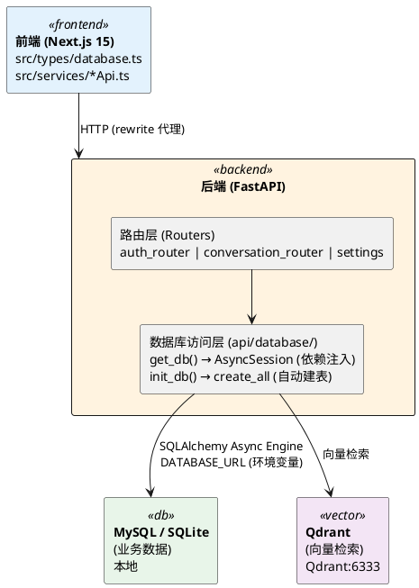
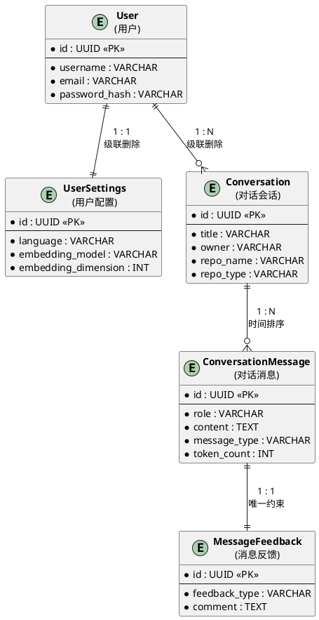
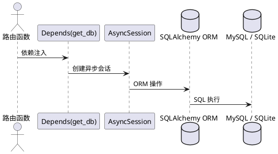
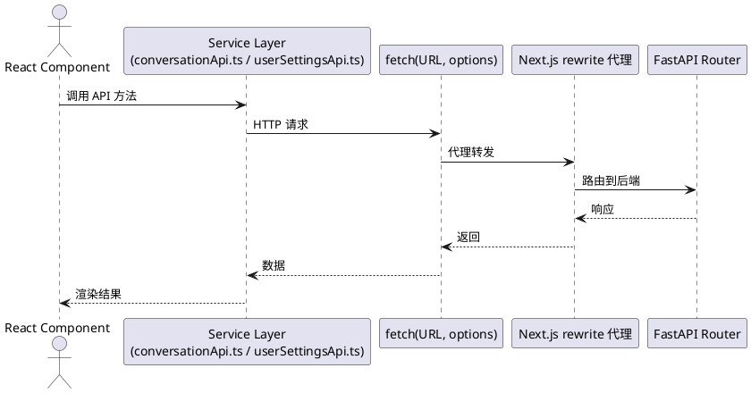
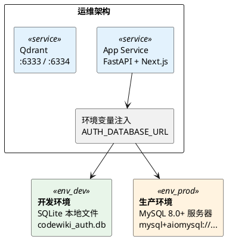

# CodeWiki 数据库概要设计

## 一、数据库技术选型

| 决策项 | 选择 | 选型理由 |
|--------|------|----------|
| **关系型数据库** | MySQL 8.0+（生产）/ SQLite（开发） | MySQL 具备成熟的事务支持和 CHECK 约束能力；SQLite 满足本地开发零配置需求 |
| **ORM 框架** | SQLAlchemy 2.0（异步模式） | Python 生态最成熟的异步 ORM，与 FastAPI 深度集成，支持连接池与声明式模型 |
| **异步驱动** | aiomysql（MySQL）/ aiosqlite（SQLite） | 匹配 FastAPI 的异步编程模型，避免阻塞事件循环 |
| **向量数据库** | Qdrant | 专为稠密向量检索设计的向量数据库，支持亿级向量毫秒级召回 |
| **密码哈希** | bcrypt（via passlib） | 行业标准，抗暴力破解 |
| **JWT 令牌** | python-jose | 轻量级 JWT 签发/验证库 |

**总体架构**：采用 **"关系型数据库（业务数据） + 向量数据库（语义检索）"** 的混合存储架构。

---

## 二、数据库分层部署架构

**关键设计要点**：

- 前端**不直连数据库**，所有数据操作经过 FastAPI 后端路由
- Next.js 通过 `rewrites` 配置将 `/api/*` 透明代理至 FastAPI（端口 8001）
- 数据库连接 URL 通过环境变量 `AUTH_DATABASE_URL` 注入，实现开发/生产环境无缝切换
- 向量数据库 Qdrant 与关系型数据库物理隔离，各司其职

---

## 三、概念数据模型（E-R 概要）

系统涉及 **5 个核心实体**，其概念关系如下：

**实体关系说明**：

| 关系 | 基数 | 说明 |
|------|------|------|
| User ↔ UserSettings | 1:1 | 每个用户拥有一份配置，级联删除 |
| User ↔ Conversation | 1:N | 一个用户可发起多次对话，删用户时级联删除对话 |
| Conversation ↔ Message | 1:N | 一个对话包含多条消息（用户提问 + AI 回答），按时间排序 |
| Message ↔ Feedback | 1:1 | 每条 AI 回答有且仅有一条反馈记录 |

---

## 四、核心领域划分

按业务功能将数据分为以下三个领域：

### 4.1 用户与认证域

- **职责**：用户注册、登录、JWT 令牌签发与验证
- **核心数据**：用户凭证（用户名、邮箱、加密密码）、账户状态
- **安全要求**：密码禁止明文存储，使用 bcrypt 哈希；JWT 令牌通过 Cookie 传递（`cw_token`）

### 4.2 对话历史域

- **职责**：管理用户与 AI 的对话会话及消息记录
- **核心数据**：对话标题、所属仓库（owner/name/type）、消息角色、消息内容、消息类型（普通/深度研究）
- **业务规则**：
  - 对话关联特定代码仓库，便于按仓库维度检索历史
  - 消息区分 `normal` 和 `deep_research` 两种类型，深度研究消息包含 `@@PAGE@@` 分页标记
  - 支持 token 计数（用于计费和用量统计）

### 4.3 用户反馈域

- **职责**：收集用户对 AI 回答的点赞/点踩评价及文字意见
- **核心数据**：反馈类型（liked/disliked）、可选文字评论
- **业务规则**：每条 AI 回答仅允许一次反馈（unique 约束），与消息一一对应

---

## 五、数据完整性与约束设计

| 策略 | 实现方式 | 说明 |
|------|----------|------|
| **实体完整性** | UUID 主键 | 所有表使用 UUID(v4) 字符串作为主键，全局唯一，避免自增 ID 的安全隐患 |
| **参照完整性** | FK + ON DELETE CASCADE | 外键级联删除，删除用户时自动清理其对话、消息、配置和反馈 |
| **域完整性** | CHECK 约束 | `role` 限制为 'user'/'assistant'；`feedback_type` 限制为 'liked'/'disliked' |
| **唯一性约束** | UNIQUE 索引 | username、email 全局唯一；user_id（在 settings 中）、message_id（在 feedbacks 中）唯一 |
| **时间戳** | 东八区时间 | 所有 `created_at`/`updated_at` 使用北京时间（UTC+8），`updated_at` 自动更新 |
| **字符集** | utf8mb4 + utf8mb4_unicode_ci | 完整支持 Unicode（含 emoji），保障多语言兼容性 |
| **存储引擎** | InnoDB | 支持事务、行级锁和外键约束 |

---

## 六、向量数据库（Qdrant）设计概要

关系型数据库无法高效处理高维向量相似度搜索，因此引入 Qdrant 作为独立的向量存储：

| 设计项 | 说明 |
|--------|------|
| **存储内容** | 代码块的稠密向量嵌入（Embedding），由 DashScope 等模型生成 |
| **集合命名** | `codewiki_<仓库名>`，每个仓库一个独立 Collection |
| **向量维度** | 由用户配置中的 `embedding_dimension` 决定，默认 1536（DashScope text-embedding-v1） |
| **元数据** | 函数名、文件路径、起始行号、结束行号 |
| **检索方式** | 基于余弦相似度的 Top-K 最近邻检索，Top-K 值由用户配置决定 |
| **使用场景** | RAG（检索增强生成）：AI 问答前先从 Qdrant 检索相关代码片段，作为上下文注入 LLM |
| **与关系型DB的关系** | 完全解耦 —— Qdrant 负责语义检索，MySQL 负责业务数据持久化，二者通过仓库名逻辑关联 |

数据流向：`用户提问 → Embedding → Qdrant 向量检索 → 召回代码片段 + 对话历史 → LLM 生成回答 → 写入 MySQL`

---

## 七、数据访问模式设计

### 7.1 后端（Python FastAPI）

- `get_db()` 作为 FastAPI 依赖，通过 `async_sessionmaker` 为每个请求创建独立的异步会话
- 会话在请求结束后自动关闭，无需手动管理
- 启动时通过 `Base.metadata.create_all` 自动建表（开发模式）

### 7.2 前端（TypeScript）

- 前端通过 TypeScript 类型定义（`src/types/database.ts`）保证类型安全
- Service 层封装所有 API 调用，组件不直接接触 HTTP 细节

---

## 八、数据库环境与运维架构

- **开发环境**：零配置，SQLite 文件自动创建于项目根目录
- **生产环境**：通过 `AUTH_DATABASE_URL` 切换为 MySQL，启用连接池（`pool_recycle` + `pool_pre_ping`）
- 当前**不依赖迁移工具**，使用 SQLAlchemy 的 `create_all` 自动同步模型到数据库
- 内置 MySQL 原始 SQL 初始化脚本（`api/database/init.sql`），供手动部署使用

---

## 九、技术债务与演进建议

| 现状 | 建议 | 优先级 |
|------|------|--------|
| 无数据库迁移管理 | 引入 Alembic 进行版本化迁移管理 | 高（生产必做） |
| 对话标题自动截断逻辑在前端 | 应移至后端或数据库触发器，保证一致性 | 中 |
| Qdrant 与 MySQL 无物理关联 | 可考虑在 MySQL 中记录仓库 → Qdrant Collection 映射关系 | 低 |
| 无数据库备份策略 | 制定定期备份方案（MySQL dump / Qdrant snapshot） | 高（生产必做） |
| 无读写分离 | 高并发时可引入读写分离架构 | 低 |
