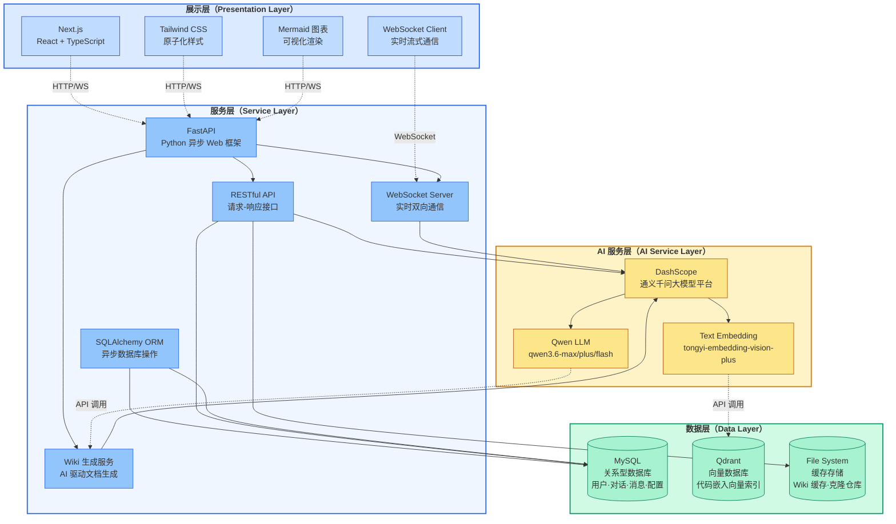
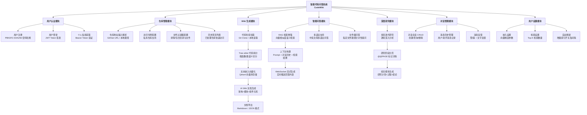
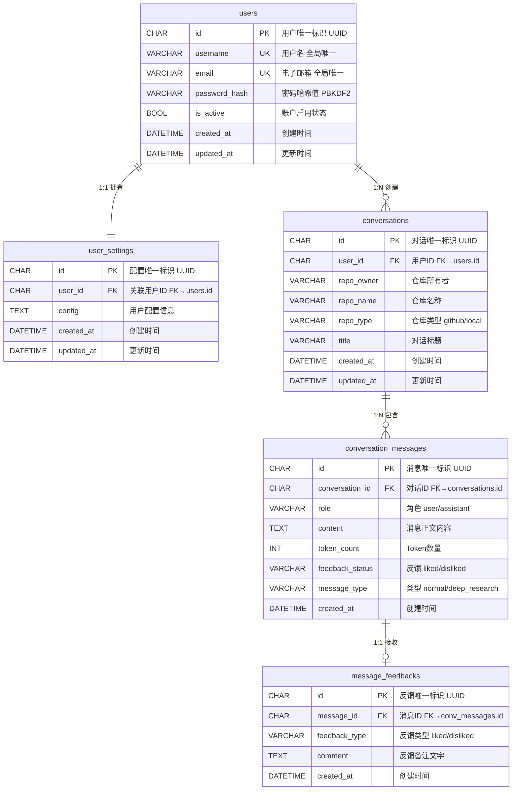

# 第 3 章 智能代码问答系统概要设计

## 3.1 引言

本章主要内容为智能代码问答系统（CodeWiki）进行概要设计。在本章中对系统的技术架构设计、系统用户端的功能模块设计进行了详细的设计，此外，还对系统数据库进行了详细的设计，对系统数据进行分析后对数据库实体关系进行了分析与设计并对每个功能模块涉及的详细数据库表进行了设计，同时确定了前后端连接的接口定义设计。

## 3.2 系统架构设计

本项目采取前后端分离的方式进行开发。前端实现使用技术栈为 Next.js 框架 + React + TypeScript + Tailwind CSS，后端主要采用 Python FastAPI 框架 + SQLAlchemy ORM 进行实现，前后端之间通过 RESTful API 与 WebSocket 进行数据交互，向量数据库使用 Qdrant，关系型数据库使用 MySQL。AI 服务层采用 DashScope（通义千问 Qwen 系列模型）提供大语言模型生成能力与文本嵌入能力。

智能代码问答系统的技术架构如图 3-1 所示。

> **图 3-1 智能代码问答系统技术架构图**

本系统采用分层架构设计，自上而下分为展示层、服务层、AI 服务层和数据层四个层次，各层职责明确，通过清晰的接口进行交互。

**展示层**对应前端页面绘制，主要为 Web 端开发，用户可通过 Chrome 或 Edge 等主流浏览器访问。UI 实现主要采用 Next.js 框架 + React 组件化开发方式实现。Next.js 是一个基于 React 的全栈 Web 开发框架，支持服务端渲染（SSR）、静态站点生成（SSG）以及 API 路由等功能，能够提供优秀的首屏加载性能和搜索引擎优化（SEO）表现。React 采用声明式的、组件化的编程方式，使开发者能够更高效地构建用户界面。在样式方面，项目采用 Tailwind CSS 原子化 CSS 框架，通过组合预定义的样式类快速构建界面，避免了传统 CSS 的样式冲突和维护困难的问题。此外，项目还集成了 Mermaid 图表渲染组件，支持在 Wiki 页面中渲染架构图、流程图和时序图等可视化内容。

**服务层**对应后端实现，主要采用 Python FastAPI 框架 + SQLAlchemy ORM。FastAPI 是一个现代、高性能的 Python Web 框架，基于 Starlette 和 Pydantic 构建，支持异步请求处理、自动生成 OpenAPI 文档和类型校验等特性，其性能可与 Node.js 和 Go 相媲美。SQLAlchemy 是 Python 生态中最流行的 ORM 框架之一，提供了完整的 SQL 工具包和对象关系映射能力，支持异步数据库操作，为系统的数据持久化提供了坚实的基础。服务层通过 RESTful API 接口接收前端请求，通过 WebSocket 协议实现实时的 AI 对话流式响应。

**AI 服务层**负责大语言模型调用与文本嵌入服务。本项目采用阿里云 DashScope 平台提供的通义千问 Qwen 系列模型作为核心 AI 引擎，具体支持 qwen3.6-max-preview、qwen3.6-plus、qwen3.6-flash 等多种规格的大语言模型用于代码问答和 Wiki 文档生成，同时采用 tongyi-embedding-vision-plus 模型提供文本嵌入服务，将代码片段转化为高维向量用于语义检索。AI 服务层通过适配器模式对模型调用进行了统一封装，使系统具备良好的可扩展性，未来可便捷地接入其他模型提供商。

**数据层**采用双重存储架构。关系型数据使用 MySQL 数据库进行存储，MySQL 是最流行的关系型数据库管理系统之一，具有高性能、高可靠性和易用性等优点，负责存储用户账户信息、用户配置偏好、对话历史记录和消息内容等结构化数据。向量数据使用 Qdrant 向量数据库进行存储，Qdrant 是一个高性能的向量相似度搜索引擎，采用 Rust 语言编写，支持 cosine 距离、欧氏距离等多种相似度度量方式，负责存储代码仓库的文本嵌入向量，为 RAG（检索增强生成）检索提供高效的语义搜索能力。

## 3.3 功能模块设计

智能代码问答系统的功能主要面向用户端，包括用户认证模块、仓库管理模块、Wiki 生成模块、智能问答模块、深度研究模块、对话管理模块和用户设置模块七个功能模块，每个模块包含不同的功能实现。具体的智能代码问答系统功能模块设计图如图 3-2 所示。

> **图 3-2 智能代码问答系统功能模块设计图**

### 3.3.1 用户认证模块

用户认证模块包括用户注册、登录和身份验证三个核心功能。该模块在后端路由文件 [auth_router.py](file:///d:/bishe/codewiki/api/auth_router.py) 中实现，前端由 AuthContext 上下文组件统一管理认证状态。

在用户注册方面，系统要求提供用户名、电子邮箱和密码，注册时对用户名和邮箱进行唯一性校验。密码通过 passlib 库使用 PBKDF2-SHA256 算法进行哈希处理后存储于 users 表的 password_hash 字段，系统中任何环节不存储明文密码。在用户登录方面，系统验证用户名和密码后颁发 JWT 访问令牌，采用 HS256 算法签名，Token 包含用户 ID、签发时间和过期时间，默认有效期为 60 分钟。后续请求通过 Bearer Token 方式进行身份验证，由 get_current_user 依赖注入函数统一拦截校验——前端在应用启动时自动验证 Token 有效性，过期则静默登出。

### 3.3.2 仓库管理模块

仓库管理模块是系统的入口模块，提供代码仓库的输入解析、类型识别和管理功能，主要集中在前端 Dashboard 页面组件 [dashboard/page.tsx](file:///d:/bishe/codewiki/src/app/dashboard/page.tsx) 中。

在输入解析方面，系统支持三种格式：GitHub 仓库 URL（自动解析出 owner 和 repo 名称）、本地文件系统路径（Windows 或 Unix 绝对路径，类型设为 local）和自定义 Git 仓库地址。在文件过滤配置方面，系统提供排除模式（默认忽略虚拟环境、版本控制、构建输出、缓存目录等）和包含模式（仅处理指定目录和文件），过滤器配置通过 localStorage 以仓库 URL 为键进行缓存。此外，该模块还支持配置 GitHub Personal Access Token 以访问私有仓库，并提供了历史项目列表展示功能，用户可快速访问之前分析过的仓库。

### 3.3.3 Wiki 生成模块

Wiki 生成模块利用 AI 大语言模型自动分析代码仓库并生成结构化的 Wiki 文档。该模块涉及代码拉取、代码拆分、向量嵌入、文档生成与缓存管理五个环节。

代码拉取阶段通过 [data_pipeline.py](file:///d:/bishe/codewiki/api/data_pipeline.py) 中的 download_repo 函数执行 Git 浅克隆操作（`git clone --depth=1`），若本地已有仓库则直接复用。代码拆分阶段使用 [code_splitter.py](file:///d:/bishe/codewiki/api/code_splitter.py) 中的 Tree-sitter 语义拆分器，支持 Python、JavaScript、TypeScript、Java、Go、Rust、C/C++、C#、PHP、Swift 等主流语言，按函数、类、方法等语义单元精确切分代码，切分后的代码块附带文件路径、函数名、类名、行号等元数据。向量嵌入阶段调用 DashScope 平台的嵌入模型将文本块转换为稠密向量，存储于 Qdrant 向量数据库的独立集合中，采用余弦距离作为相似度度量。生成的 Wiki 文档以 JSON 格式缓存至服务器文件系统，支持按用户和语言隔离，并可通过 /export/wiki 接口导出为 Markdown 或 JSON 格式。此外，系统通过 [incremental_index.py](file:///d:/bishe/codewiki/api/incremental_index.py) 实现了增量索引刷新功能，定期检测仓库变更并仅更新变化的文件，避免全量重建。

### 3.3.4 智能问答模块

智能问答模块采用 RAG（检索增强生成）技术为用户提供精准的代码问答服务，核心实现在 [rag.py](file:///d:/bishe/codewiki/api/rag.py) 和 [websocket_wiki.py](file:///d:/bishe/codewiki/api/websocket_wiki.py) 中。

该模块通过 WebSocket 协议（`/ws/chat`）进行实时流式交互。当用户提问时，系统首先将问题转换为嵌入向量并在 Qdrant 中进行余弦相似度检索，获取语义最相关的代码片段作为上下文。然后构建包含系统提示词、历史对话、检索上下文、当前文件内容和用户问题的完整 Prompt。最后通过 DashscopeClient 异步调用大语言模型进行流式生成，文本片段通过 WebSocket 实时推送到前端渲染。系统内置了 Token 超限降级机制，当上下文过长时自动移除检索上下文进行重试。该模块还支持指定文件路径的聚焦问答、多语言问答以及自定义检索参数（top_k、嵌入维度等）。

### 3.3.5 深度研究模块

深度研究模块是在智能问答基础上的增强功能，通过独立的 WebSocket 端点 `/ws/chat/deep-research` 实现多轮迭代研究，最大迭代次数为 5 轮。

该模块的核心机制是服务端循环控制：每轮迭代执行 RAG 检索获取上下文，使用分阶段的系统提示词引导模型输出不同深度的成果——首轮输出研究计划与初步发现，中间轮次在前一轮基础上进一步深入，末轮综合所有发现形成最终结论。模型输出通过 `@@PAGE|type|title@@` 标记符分隔各轮结果，前端 Ask 组件解析这些标记符以分页形式展示，用户可在"研究计划 → 逐轮深入 → 最终结论"之间自由切换浏览。

### 3.3.6 对话管理模块

对话管理模块负责用户与 AI 之间对话会话的全生命周期管理，后端路由实现在 [conversation_router.py](file:///d:/bishe/codewiki/api/conversation_router.py) 中，所有端点均要求 Bearer Token 认证。

该模块提供对话会话的创建、查询（按仓库过滤，更新时间倒序）和删除（级联删除消息）功能，以及消息的完整 CRUD 操作，支持区分普通消息和深度研究消息两种类型。所有操作均验证当前用户对对话的所有权，防止越权访问。此外还提供消息反馈功能，用户可对 AI 回答进行"赞"或"踩"的评价并附文字反馈，反馈数据便于后续回答质量评估。前端通过 [Ask.tsx](file:///d:/bishe/codewiki/src/app/components/Ask.tsx) 组件提供对话边栏展示、新对话创建和消息反馈等交互界面。

### 3.3.7 用户设置模块

用户设置模块允许用户个性化配置系统运行参数，后端路由在 [settings_router.py](file:///d:/bishe/codewiki/api/settings_router.py) 中通过 `/api/user/settings` 端点实现 GET 和 PUT 操作，前端服务层在 [userSettingsApi.ts](file:///d:/bishe/codewiki/src/services/userSettingsApi.ts) 中封装。

用户配置以 JSON 格式存储在 user_settings 表的 config 字段中，包含三个子模块：嵌入设置（向量维度，默认 1024）、检索设置（RAG 返回文档数 top_k，默认 20）和自动刷新设置（增量索引开关及间隔，默认启用/60 分钟）。更新采用增量合并策略，避免全量覆盖导致配置丢失。前端在发起问答请求时自动携带用户配置的检索参数，确保个性化设置在整个流程中生效。

## 3.4 数据库设计

### 3.4.1 数据库实体关系设计

根据对本系统的数据分析，数据库实体关系设计如图 3-5 所示。

> **图 3-5 智能代码问答系统实体关系设计图**

数据库共包含主要实体 5 个，分别为用户、用户配置、对话、对话消息和消息反馈。用户实体的属性包括用户 ID、用户名、电子邮箱、密码哈希、激活状态、创建时间和更新时间，用户配置实体的属性包括配置 ID、关联用户 ID、配置信息、创建时间和更新时间，对话实体的属性包括对话 ID、仓库所有者、仓库名称、仓库类型、对话标题、创建时间和更新时间，对话消息实体的属性包括消息 ID、消息角色、消息内容、Token 数量、反馈状态、消息类型和创建时间，消息反馈实体的属性包括反馈 ID、反馈类型和反馈备注。

各个实体间的关系包含一对一和一对多两种，具体如下：用户实体对用户配置实体为一对一关系，即一个用户对应一个个性化配置；用户实体对对话实体为一对多关系，即一个用户可以创建多个对话会话；对话实体对对话消息实体为一对多关系，即一个对话包含多条消息；对话消息实体对消息反馈实体为一对一关系，即一条消息可以有一个用户反馈评价。所有外键关系均设置了级联删除（ON DELETE CASCADE），确保在删除用户或对话时自动清理关联数据，保证数据的完整性和一致性。

### 3.4.2 数据库概念模型设计

通过对本系统的数据分析，确定所需要用的数据库表格共有 5 个，分别为用户账户表、用户配置表、对话历史表、对话消息表和消息反馈表，各个数据库表对应的英文表名和具体描述如表 3-1 所示。

> **表 3-1 数据库表目录**
> （此处插入数据库表目录表格）

| 序号 | 英文表名 | 中文名称 | 功能描述 |
| --- | --- | --- | --- |
| 1 | users | 用户账户表 | 存储用户的基本认证信息 |
| 2 | user_settings | 用户配置表 | 存储用户个性化偏好设置 |
| 3 | conversations | 对话历史表 | 存储用户与 AI 的对话会话 |
| 4 | conversation_messages | 对话消息表 | 存储对话中每条具体消息 |
| 5 | message_feedbacks | 消息反馈表 | 存储用户对消息的评价反馈 |

以下分别对表 3-1 数据库表目录中提到的数据库表进行介绍。

用户账户表的作用是存储用户的基本认证信息，包含的字段名有 id、username、email、password_hash、is_active、created_at、updated_at，其中字段名 id 为该表的主键。用户名和电子邮箱均设置为全局唯一约束，密码字段存储经过 PBKDF2-SHA256 算法哈希处理后的值，禁止明文存储。用户账户表的设计如表 3-2 所示。

> **表 3-2 数据库表 users 设计表**
> （此处插入 users 表结构设计详细表格）

| 字段名 | 数据类型 | 约束 | 说明 |
| --- | --- | --- | --- |
| id | CHAR(36) | PRIMARY KEY, DEFAULT (UUID()) | 用户唯一标识（UUID） |
| username | VARCHAR(64) | NOT NULL, UNIQUE | 用户名，全局唯一 |
| email | VARCHAR(255) | NOT NULL, UNIQUE | 电子邮箱地址，全局唯一 |
| password_hash | VARCHAR(255) | NOT NULL | 密码哈希值（PBKDF2-SHA256） |
| is_active | TINYINT(1) | NOT NULL, DEFAULT 1 | 账户是否启用 |
| created_at | DATETIME | NOT NULL, DEFAULT CURRENT_TIMESTAMP | 账户创建时间 |
| updated_at | DATETIME | NOT NULL, ON UPDATE CURRENT_TIMESTAMP | 账户最后更新时间 |

用户配置表的作用是存储用户的个性化偏好设置，与用户账户表为一对一关联，包含的字段名有 id、user_id、config、created_at、updated_at，其中字段名 id 为该表的主键，user_id 为外键关联到 users 表。config 字段采用 TEXT 类型，用于存储嵌入维度、检索参数和自动刷新等扩展配置信息。用户配置表的设计如表 3-3 所示。

> **表 3-3 数据库表 user_settings 设计表**
> （此处插入 user_settings 表结构设计详细表格）

| 字段名 | 数据类型 | 约束 | 说明 |
| --- | --- | --- | --- |
| id | CHAR(36) | PRIMARY KEY, DEFAULT (UUID()) | 配置唯一标识 |
| user_id | CHAR(36) | NOT NULL, UNIQUE, FK → users.id | 关联用户 ID |
| config | TEXT | NULL | 用户配置信息（JSON 格式文本） |
| created_at | DATETIME | NOT NULL, DEFAULT CURRENT_TIMESTAMP | 配置创建时间 |
| updated_at | DATETIME | NOT NULL, ON UPDATE CURRENT_TIMESTAMP | 配置最后更新时间 |

对话历史表的作用是存储用户与 AI 模型的对话会话信息，包含的字段名有 id、user_id、repo_owner、repo_name、repo_type、title、created_at、updated_at，其中字段名 id 为该表的主键，字段名 user_id 为外键关联到 users 表。每条对话记录与一个特定的代码仓库关联，通过 repo_owner 和 repo_name 字段标识。对话历史表的设计如表 3-4 所示。

> **表 3-4 数据库表 conversations 设计表**
> （此处插入 conversations 表结构设计详细表格）

| 字段名 | 数据类型 | 约束 | 说明 |
| --- | --- | --- | --- |
| id | CHAR(36) | PRIMARY KEY, DEFAULT (UUID()) | 对话唯一标识 |
| user_id | CHAR(36) | NOT NULL, FK → users.id | 发起对话的用户 ID |
| repo_owner | VARCHAR(255) | NOT NULL | 仓库所有者 |
| repo_name | VARCHAR(255) | NOT NULL | 仓库名称 |
| repo_type | VARCHAR(32) | NOT NULL, DEFAULT 'github' | 仓库类型 |
| title | VARCHAR(512) | NULL | 对话标题 |
| created_at | DATETIME | NOT NULL, DEFAULT CURRENT_TIMESTAMP | 对话创建时间 |
| updated_at | DATETIME | NOT NULL, ON UPDATE CURRENT_TIMESTAMP | 对话最后更新时间 |

对话消息表的作用是存储对话中每条具体消息的内容，包含的字段名有 id、conversation_id、role、content、token_count、feedback_status、message_type、created_at，其中字段名 id 为该表的主键，字段名 conversation_id 为外键关联到 conversations 表。role 字段通过 CHECK 约束限制只能为 'user' 或 'assistant'。message_type 字段区分普通对话消息（normal）和深度研究消息（deep_research）。对话消息表的设计如表 3-5 所示。

> **表 3-5 数据库表 conversation_messages 设计表**
> （此处插入 conversation_messages 表结构设计详细表格）

| 字段名 | 数据类型 | 约束 | 说明 |
| --- | --- | --- | --- |
| id | CHAR(36) | PRIMARY KEY, DEFAULT (UUID()) | 消息唯一标识 |
| conversation_id | CHAR(36) | NOT NULL, FK → conversations.id | 所属对话 ID |
| role | VARCHAR(16) | NOT NULL, CHECK IN ('user','assistant') | 消息角色 |
| content | TEXT | NOT NULL | 消息正文内容 |
| token_count | INT | NULL | Token 数量 |
| feedback_status | VARCHAR(16) | NULL, CHECK IN ('liked','disliked') | 反馈状态 |
| message_type | VARCHAR(16) | NOT NULL, DEFAULT 'normal' | 消息类型 |
| created_at | DATETIME | NOT NULL, DEFAULT CURRENT_TIMESTAMP | 消息创建时间 |

消息反馈表的作用是存储用户对 AI 回答消息的详细反馈信息，包含的字段名有 id、message_id、feedback_type、comment、created_at，其中字段名 id 为该表的主键，字段名 message_id 为外键关联到 conversation_messages 表。消息反馈表的设计如表 3-6 所示。

> **表 3-6 数据库表 message_feedbacks 设计表**
> （此处插入 message_feedbacks 表结构设计详细表格）

| 字段名 | 数据类型 | 约束 | 说明 |
| --- | --- | --- | --- |
| id | CHAR(36) | PRIMARY KEY, DEFAULT (UUID()) | 反馈唯一标识 |
| message_id | CHAR(36) | NOT NULL, FK → conversation_messages.id | 关联消息 ID |
| feedback_type | VARCHAR(16) | NOT NULL, CHECK IN ('liked','disliked') | 反馈类型 |
| comment | TEXT | NULL | 反馈备注文字 |
| created_at | DATETIME | NOT NULL, DEFAULT CURRENT_TIMESTAMP | 反馈创建时间 |

所有数据库表均使用 InnoDB 存储引擎以支持外键约束和事务操作，字符集统一采用 utf8mb4（utf8mb4_unicode_ci 排序规则），确保完整支持 Unicode 字符（包括 Emoji）。所有外键约束均设置 ON DELETE CASCADE 级联删除策略，保证数据引用完整性。系统支持 MySQL 8.0+ 和 SQLite 两种数据库后端，通过 SQLAlchemy ORM 实现了数据库后端的透明切换，开发环境可使用 SQLite 文件数据库以降低环境搭建成本，生产环境推荐使用 MySQL 以获得更好的并发性能和可靠性。

## 3.5 接口定义设计

本系统前后端之间的接口通信采用两种模式：对于普通的 CRUD 操作，使用 RESTful API 进行请求-响应式交互；对于 AI 对话生成等需要实时流式响应的场景，使用 WebSocket 协议进行双向通信。以下对本系统涉及的主要接口进行定义说明。

本系统用户认证相关接口设计如表 3-7 所示。

> **表 3-7 智能代码问答系统用户认证接口设计表**
> （此处插入认证接口设计详细表格）

| 序号 | 接口路径 | 请求方式 | 接口说明 | 认证要求 |
| --- | --- | --- | --- | --- |
| 1 | /auth/register | POST | 用户注册，创建新账户并返回 JWT 令牌 | 无需认证 |
| 2 | /auth/login | POST | 用户登录，验证用户名密码并返回 JWT 令牌 | 无需认证 |
| 3 | /auth/me | GET | 获取当前登录用户的个人信息 | Bearer Token |

本系统对话管理相关接口设计如表 3-8 所示。

> **表 3-8 智能代码问答系统对话管理接口设计表**
> （此处插入对话管理接口设计详细表格）

| 序号 | 接口路径 | 请求方式 | 接口说明 | 认证要求 |
| --- | --- | --- | --- | --- |
| 1 | /api/conversations | GET | 获取指定仓库下的对话历史列表 | Bearer Token |
| 2 | /api/conversations | POST | 创建新的对话会话 | Bearer Token |
| 3 | /api/conversations/{id} | DELETE | 删除指定对话及其所有消息 | Bearer Token |
| 4 | /api/conversations/{id}/messages | GET | 获取指定对话的消息列表 | Bearer Token |
| 5 | /api/conversations/{id}/messages | POST | 在指定对话中创建新消息 | Bearer Token |
| 6 | /api/conversations/{id}/messages/{mid} | DELETE | 删除指定对话中的某条消息 | Bearer Token |
| 7 | /api/conversations/{id}/messages/{mid}/feedback | POST | 对指定消息提交反馈评价 | Bearer Token |

本系统 AI 问答与 Wiki 生成相关接口设计如表 3-9 所示。

> **表 3-9 智能代码问答系统 AI 问答与 Wiki 接口设计表**
> （此处插入 AI 问答与 Wiki 接口设计详细表格）

| 序号 | 接口路径 | 通信方式 | 接口说明 | 认证要求 |
| --- | --- | --- | --- | --- |
| 1 | /ws/chat | WebSocket | 实时流式 AI 代码问答（基于 RAG 检索增强） | 无需认证 |
| 2 | /ws/chat/deep-research | WebSocket | 多轮深度研究模式问答 | 无需认证 |
| 3 | /chat/completions/stream | POST | HTTP 流式 AI 问答（兼容端点） | 无需认证 |
| 4 | /api/wiki_cache | GET | 获取缓存的 Wiki 数据 | 无需认证 |
| 5 | /api/wiki_cache | POST | 保存生成的 Wiki 数据到缓存 | 无需认证 |
| 6 | /api/wiki_cache | DELETE | 删除指定仓库的 Wiki 缓存及向量索引 | 授权码认证 |
| 7 | /export/wiki | POST | 导出 Wiki 为 Markdown 或 JSON 格式 | 无需认证 |

本系统辅助功能接口设计如表 3-10 所示。

> **表 3-10 智能代码问答系统辅助功能接口设计表**
> （此处插入辅助功能接口设计详细表格）

| 序号 | 接口路径 | 请求方式 | 接口说明 | 认证要求 |
| --- | --- | --- | --- | --- |
| 1 | /models/config | GET | 获取可用 AI 模型提供商及模型列表配置 | 无需认证 |
| 2 | /api/user/settings | GET | 获取当前用户的个性化配置 | Bearer Token |
| 3 | /api/user/settings | PUT | 更新当前用户的个性化配置 | Bearer Token |
| 4 | /api/processed_projects | GET | 获取已处理的仓库项目列表 | 无需认证 |
| 5 | /api/repos/refresh | POST | 手动触发增量索引刷新 | 无需认证 |
| 6 | /local_repo/structure | GET | 获取本地仓库的文件树和 README 内容 | 无需认证 |
| 7 | /auth/status | GET | 检查 Wiki 访问是否需要授权认证 | 无需认证 |
| 8 | /lang/config | GET | 获取系统支持的语言配置 | 无需认证 |
| 9 | /health | GET | 系统健康检查端点 | 无需认证 |

WebSocket 接口的通信流程为：前端首先建立 WebSocket 连接，连接成功后发送 JSON 格式的请求体（包含仓库 URL、对话消息列表、模型提供商、模型名称、语言设置、检索参数等信息），后端在接收到请求后执行代码检索和 RAG 增强流程，通过 WebSocket 连接持续推送生成的文本片段，前端实时渲染展示。对于深度研究模式，后端通过 @@PAGE|type|title@@ 标记分隔不同研究阶段的内容，前端据此分页展示研究报告。

## 3.6 本章小结

本章对智能代码问答系统进行了概要设计，完成了对系统开发所需的架构的设计——包括基于 Next.js + React 的前端展示层、基于 FastAPI + SQLAlchemy 的后端服务层、基于 DashScope 通义千问模型的 AI 服务层以及基于 MySQL + Qdrant 双重存储的数据层的四层架构；完成了对系统用户端功能模块的设计——包括用户认证模块、仓库管理模块、Wiki 生成模块、智能问答模块、深度研究模块、对话管理模块和用户设置模块七个核心功能模块的划分与功能定义；完成了数据库实体关系的设计——确定了用户、用户配置、对话、对话消息和消息反馈五个核心实体及其间的关联关系；完成了数据库概念模型的设计——包括用户账户表、用户配置表、对话历史表、对话消息表和消息反馈表共五张数据库表的详细结构设计。最后还根据功能模块进行具体功能分析，对前后端接口进行定义，完成了 RESTful API 和 WebSocket 共两大类 28 个接口的定义设计。概要设计着重分析设计了系统的功能与模块之间的交互，为接下来对系统的详细设计与实现打下基础。
