# 第 4 章 智能代码问答系统详细设计与实现

## 4.1 引言

本章在第 3 章概要设计的基础上，对智能代码问答系统（CodeWiki）各个核心功能模块进行详细设计与实现。本章将逐一阐述每个功能模块的具体实现细节和运行流程，给出对应的流程图或活动图辅助理解。

本系统的核心功能模块包括用户认证模块、仓库管理模块、Wiki 生成模块、智能问答模块、深度研究模块、对话管理模块和用户设置模块七个功能模块。下面将逐一对上述七个功能模块进行详细设计。

## 4.2 智能代码问答系统功能模块详细设计

### 4.2.1 用户认证模块详细设计

用户认证模块是系统的安全入口，包括用户注册、用户登录、Token 验证和路由守卫四个主要功能。该模块在后端由 [auth_router.py](file:///d:/bishe/codewiki/api/auth_router.py) 实现核心认证逻辑，在前端由 AuthContext 上下文组件统一管理认证状态，配合 Next.js 中间件实现页面级路由拦截。

**（1）用户注册**

用户通过注册页面创建新账户，填写用户名、邮箱、密码和确认密码四个字段。前端提交时执行三层校验：首先检查所有字段非空，其次校验两次密码输入一致，最后检查密码长度不少于 8 个字符。校验通过后调用 `POST /auth/register` 端点发送注册请求，请求体通过 Pydantic `RegisterRequest` 模型进行自动校验。

后端接收注册请求后，首先检查用户名和邮箱是否已被占用。若用户名重复返回 HTTP 409 状态码和"用户名已被占用"错误；若邮箱重复返回"该邮箱已注册"错误。均未占用时，调用 PBKDF2-SHA256 算法对密码进行哈希处理，通过引入随机盐值和多轮迭代（默认 29000 轮）增加暴力破解成本。哈希后的密码存入 `users` 表的 `password_hash` 字段，系统全程不存储明文密码。用户记录写入数据库后，系统直接签发 JWT Token 实现注册即登录，无需二次认证。

前端接收成功响应后，将用户信息存入 `localStorage` 的 `cw_user` 键，JWT Token 存入 `cw_token` 键，同时设置 Cookie `cw_authed=1` 供中间件识别，最后跳转至仪表盘页面。用户注册的活动流程如图 4-1 所示。

> **图 4-1 用户注册活动图**

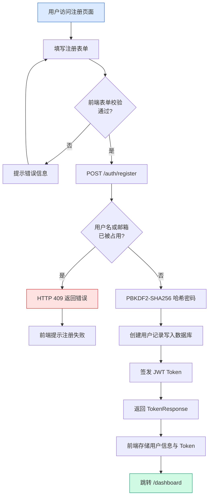

**（2）用户登录**

用户通过登录页面填写用户名和密码，前端检查两者均非空后调用 `POST /auth/login` 端点。后端以用户名为条件查询 `users` 表，若用户不存在或密码验证不通过，统一返回 HTTP 401 和"用户名或密码错误"，不区分具体原因以防止用户枚举攻击。密码验证通过 PBKDF2-SHA256 哈希比对完成。验证通过后检查 `is_active` 字段，若账户已停用返回 HTTP 403。全部通过后签发 JWT Token 并返回用户信息，前端执行状态持久化并跳转仪表盘。登录活动流程如图 4-2 所示。

> **图 4-2 用户登录活动图**

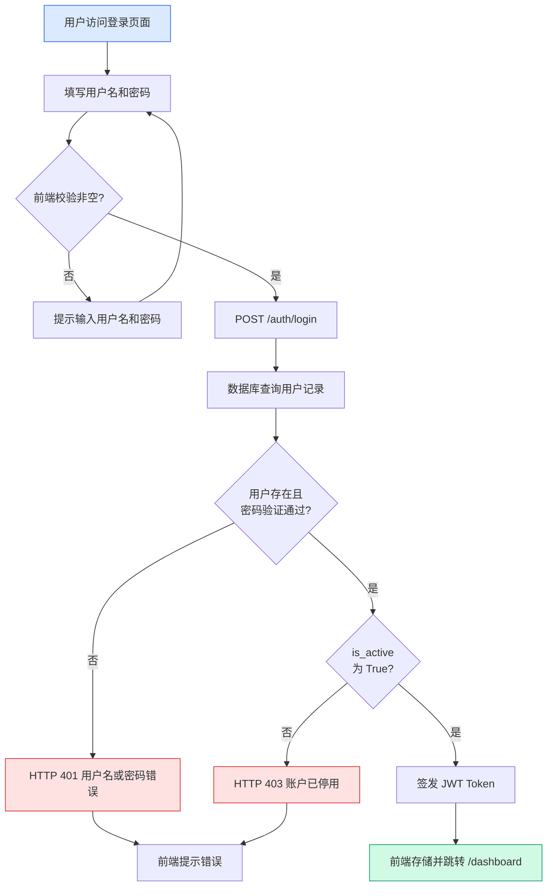

**（3）JWT Token 验证与会话保持**

所有需要认证的后端接口通过 FastAPI 依赖注入调用 `get_current_user` 函数进行统一 Token 验证。该函数从请求 `Authorization` 头提取 Bearer Token，使用 HS256 算法和 `JWT_SECRET_KEY` 密钥进行解码验签，自动校验签名有效性和过期时间。解码成功后提取用户 ID 查询数据库，验证通过返回 User 对象供业务端点使用。该依赖注入设计确保了认证逻辑与业务逻辑的清晰分离。

前端在应用初始化时从 `localStorage` 恢复用户状态，后台异步调用 `GET /auth/me` 验证 Token 有效性。若 Token 已过期则静默清除认证数据；若后端不可达则保留当前会话。Token 验证流程如图 4-3 所示。

> **图 4-3 JWT Token 验证活动图**

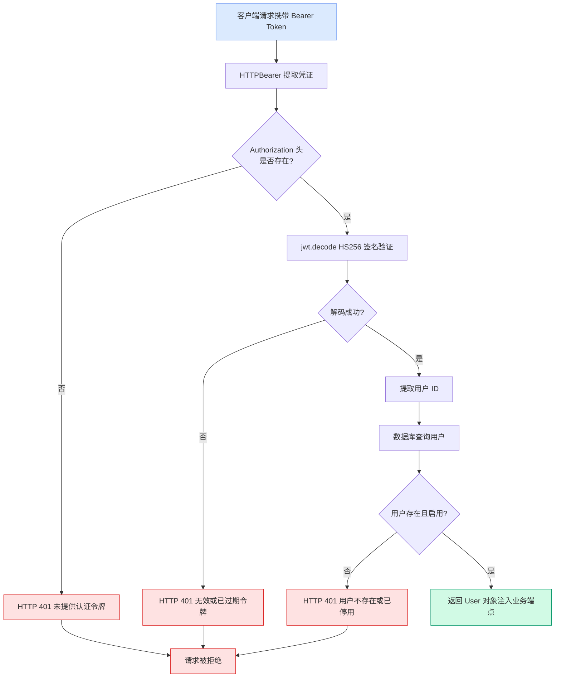

**（4）路由守卫**

系统采用双层路由守卫策略。在 Next.js 中间件层，[middleware.ts](file:///d:/bishe/codewiki/src/middleware.ts) 在每次页面请求到达服务端渲染前执行，定义了受保护路由前缀（`/dashboard`、`/wiki`、`/user`）和认证专用路由（`/login`、`/register`）。通过检查 `cw_authed` Cookie 判断登录状态：未登录用户访问受保护路由时重定向至 `/login`，已登录用户访问认证页面时重定向至 `/dashboard`。在 API 层，`get_current_user` 依赖注入为所有受限接口提供 JWT Token 校验。路由守卫流程如图 4-4 所示。

> **图 4-4 路由守卫活动图**

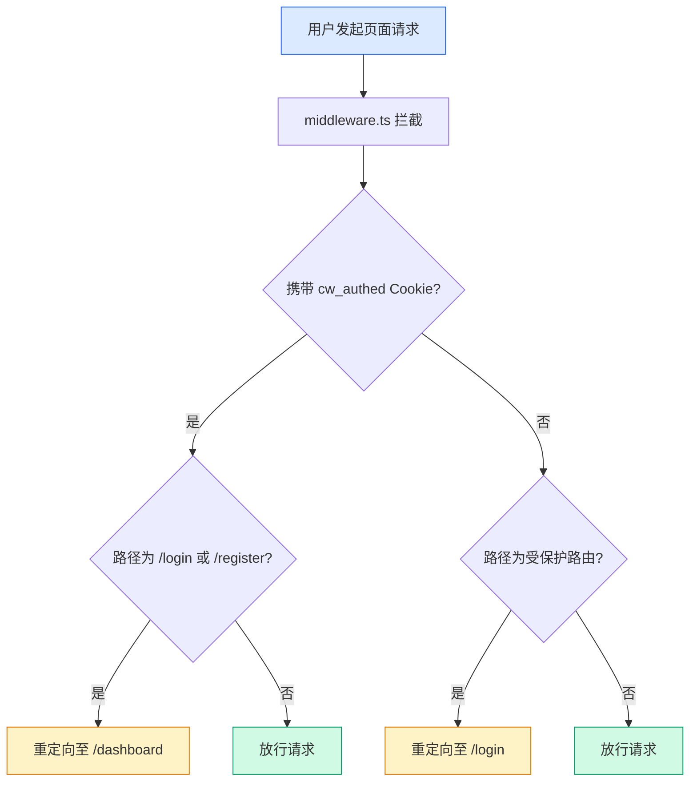

---

### 4.2.2 仓库管理模块详细设计

仓库管理模块是系统的入口模块，包括仓库输入解析、仓库类型识别、文件过滤器配置、访问令牌管理和历史项目列表五个主要功能。该模块主要集中在前端 Dashboard 页面实现，后端通过数据管道配合完成仓库下载和索引。

**（1）仓库输入解析与类型识别**

系统支持三种仓库输入格式：GitHub 仓库 URL、本地文件系统路径和自定义 Git 仓库地址。用户输入仓库地址后点击"生成 Wiki"，系统调用 `parseRepositoryInput` 函数进行解析。解析按以下顺序：首先用 Windows 路径正则匹配绝对路径（如 `C:\Users\xxx\project`），匹配成功标记为 `local` 类型；其次判断 Unix 绝对路径（以 `/` 开头），同样标记为 `local`；最后用 Git URL 正则匹配远程仓库地址，根据域名判断——`github.com` 标记为 `github`，其他标记为 `web`，同时从 URL 提取 owner 和 repo。

对于 GitHub 仓库，用户可在配置弹窗中填入 Personal Access Token 以访问私有仓库。Token 随仓库 URL 传递到后端，后端克隆时嵌入 Git URL 认证部分。

**（2）文件过滤器配置**

文件过滤支持排除模式（默认）和包含模式两种。排除模式下，用户指定的目录和文件被排除在处理范围外；包含模式下，仅处理用户指定的内容。系统内置默认排除列表，包括虚拟环境目录（`.venv/`、`node_modules/`）、版本控制目录（`.git/`、`.svn/`）、构建输出目录（`dist/`、`build/`）、缓存目录（`__pycache__/`）、IDE 配置目录（`.idea/`、`.vscode/`）和临时目录（`logs/`、`tmp/`）等。用户可追加自定义规则，每行一条。

过滤配置以仓库 URL 为键缓存于 `localStorage` 中，再次输入相同仓库地址时自动恢复之前的全部配置参数。

**（3）Wiki 生成启动与历史项目**

用户点击"生成 Wiki"后，系统先校验仓库输入，失败则提示"Invalid repository format"。通过后弹出配置弹窗，用户可调整语言、模型、Wiki 类型和过滤器等参数。确认提交后，配置存入 `localStorage`，跳转至 `/[owner]/[repo]` 页面进入 Wiki 生成流程。

Dashboard 下半部分通过 `ProcessedProjects` 组件展示历史项目列表，支持按名称搜索过滤、点击快速进入和删除操作。仓库管理模块活动流程如图 4-5 所示。

> **图 4-5 仓库管理模块活动图**

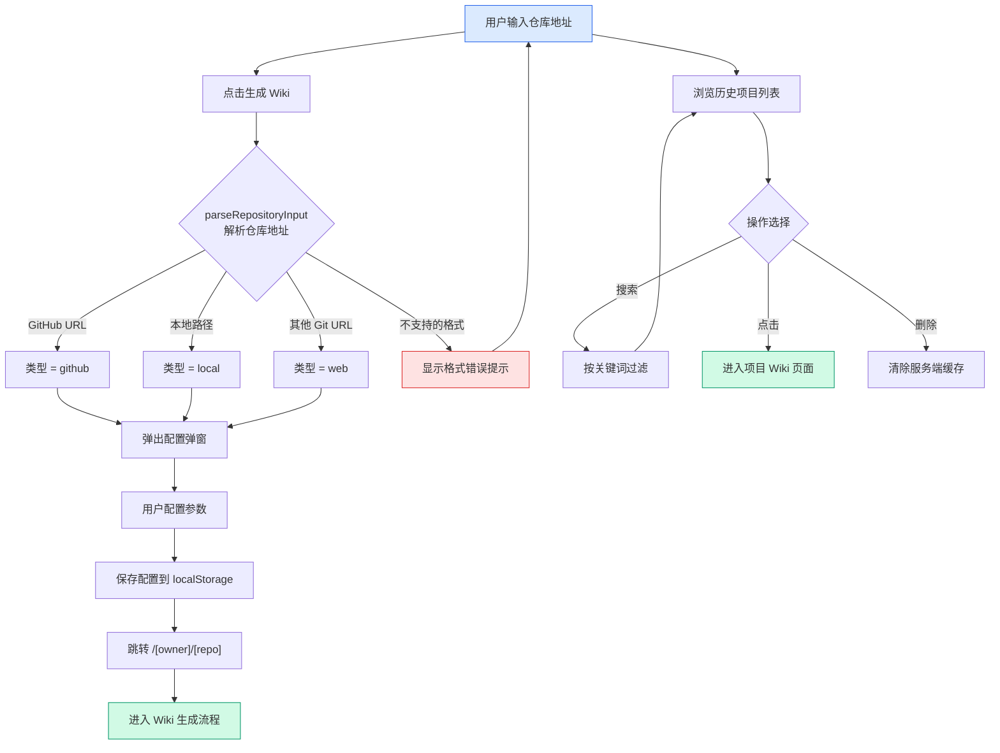

---

### 4.2.3 Wiki 生成模块详细设计

Wiki 生成模块是系统的核心功能模块，利用 AI 大语言模型自动分析代码仓库并生成结构化 Wiki 文档。该模块贯穿前后端，涉及代码拉取、语义拆分、向量嵌入、AI 文档生成和增量索引五个关键环节。

**（1）代码获取与预处理**

仓库下载由 [data_pipeline.py](file:///d:/bishe/codewiki/api/data_pipeline.py) 中的 `download_repo` 函数负责。首先检查 Git 环境可用性，然后检查本地是否已有仓库缓存，已有则直接复用。若无缓存，执行 `git clone --depth=1 --single-branch` 进行浅克隆，仅获取最新提交内容，大幅减少克隆时间和磁盘占用。若提供访问令牌，将其嵌入克隆 URL 用于访问私有仓库。

仓库下载后存储于 `~/.adalflow/repos/{owner}_{repo_name}/` 目录下。文件读取通过 `read_all_documents` 函数完成，支持排除模式和包含模式两种过滤策略。排除模式下过滤掉默认排除目录和用户自定义排除项；包含模式下仅处理用户指定的目录和文件。

**（2）语义代码拆分**

代码拆分由 [code_splitter.py](file:///d:/bishe/codewiki/api/code_splitter.py) 中的 `TreeSitterCodeSplitter` 类实现，采用 Tree-sitter 进行 AST 级别的语义切分。与固定长度切分相比，语义切分能按函数、类、方法等单元精确切分，保持代码逻辑完整性。系统支持 Python、JavaScript、TypeScript、Java、Go、Rust、C/C++、C# 等多种语言，每种语言配置对应的 AST 节点类型。对于 Markdown、JSON 等非代码文件，降级为固定长度切分（`chunk_size=1500`，`chunk_overlap=200`）。

每个切分后的代码块附带丰富元数据，包括文件路径、编程语言、函数名、类名、起止行号等。对于类内部的方法，自动追溯父类节点填充归属关系。

**（3）向量嵌入与 Qdrant 索引**

向量嵌入采用 DashScope 平台的 `tongyi-embedding-vision-plus-2026-03-06` 模型，默认输出 1024 维向量。维度确定采用三级策略：优先使用用户配置值，其次通过样本文本自动探测，最后回退默认 1024 维。Qdrant 集合以仓库名称标识，已存在的集合直接复用跳过重新索引。所有代码块批量向量化后通过 `upsert_chunks` 一次性写入 Qdrant，采用余弦距离度量。

**（4）AI Wiki 文档生成**

前端 Wiki 页面加载后建立 WebSocket 连接，向大语言模型发送生成请求。后端调用 DashScope 平台的 Qwen 系列模型，基于向量检索上下文生成结构化 Wiki 文档，内容包括项目概述、模块结构、核心组件、组件关系和数据流。生成的 Wiki 以 JSON 格式缓存于服务器文件系统，前端通过 `WikiTreeView` 组件以树形结构渲染，支持全面和简明两种视图模式切换。

**（5）增量索引刷新**

增量索引由 [incremental_index.py](file:///d:/bishe/codewiki/api/incremental_index.py) 模块实现。通过 `git pull --ff-only` 获取远程更新，`git diff` 检测文件变更（新增、修改、删除）。对于修改和删除的文件，移除对应 Qdrant 向量；对于新增和修改的文件，重新执行切分和嵌入。文件按批次处理（每批最多 120 个文件），自动刷新调度器按配置的时间间隔（默认 60 分钟）定期执行。用户也可通过 API 手动触发刷新。

Wiki 生成模块的整体处理流程如图 4-6 所示。

> **图 4-6 Wiki 生成模块处理流程图**

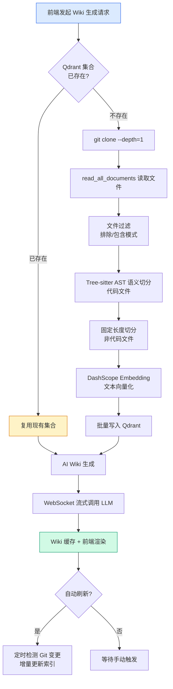

---

### 4.2.4 智能问答模块详细设计

智能问答模块采用 RAG（检索增强生成）技术架构，通过 WebSocket 协议实现实时流式交互，核心实现在 [websocket_wiki.py](file:///d:/bishe/codewiki/api/websocket_wiki.py) 和 [rag.py](file:///d:/bishe/codewiki/api/rag.py) 中。

**（1）RAG 检索管道**

RAG 检索管道的核心是 [rag.py](file:///d:/bishe/codewiki/api/rag.py) 中的 `RAG` 类。`prepare_retriever` 方法初始化检索器：首先加载或构建 Qdrant 向量索引，检查集合可用性，然后同步 Embedder 维度与 Qdrant 集合维度。`call` 方法执行语义检索：将用户查询文本通过嵌入模型转换为稠密向量，在 Qdrant 中执行余弦相似度检索，返回 top-K 个最相关的代码块及其元数据（文件路径、函数名、类名、行号等）。

**（2）上下文构建**

上下文构建由三个辅助函数协作完成。`_retrieve_context` 将检索结果按文件路径分组格式化；`_build_conversation_history` 从对话历史中提取多轮问答格式化为 XML 结构；`_build_prompt` 将系统提示词、对话历史、文件内容、检索上下文和用户问题组装为最终 Prompt。

**（3）WebSocket 流式生成**

[handle_websocket_chat](file:///d:/bishe/codewiki/api/websocket_wiki.py#L229-L366) 函数是服务端入口。WebSocket 连接建立后，接收请求数据并校验，提取用户问题，初始化 RAG 检索器，加载对话历史，执行语义检索获取相关代码上下文，组装 Prompt 后调用 DashScope LLM 进行异步流式生成。每个文本片段通过 WebSocket 实时推送到前端，由 Markdown 组件渲染。

**（4）容错降级策略**

系统内置多层降级机制：当 LLM 返回 Token 超限错误时，自动移除检索上下文降级重试；当 WebSocket 连接失败时，前端自动切换到 HTTP 流式通道；当 RAG 检索异常时，返回空上下文由 LLM 基于自身知识回答；当嵌入维度不匹配时，自动以 Qdrant 集合维度为准重新创建 Embedder。

智能问答模块的交互流程如图 4-7 所示。

> **图 4-7 智能问答模块 WebSocket 交互流程图**

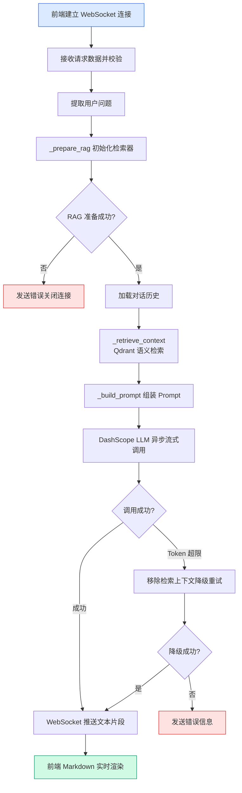

---

### 4.2.5 深度研究模块详细设计

深度研究模块在智能问答基础上增强，通过服务端控制的多轮迭代实现逐层深入的代码分析。核心实现在 `handle_websocket_chat_deep_research` 函数中，最大迭代 5 轮。

**（1）分阶段提示词设计**

系统采用三套提示词模板对应不同迭代阶段：第 1 轮使用研究计划提示词，要求 LLM 制定研究方法和步骤，识别关键方面，提供初步发现；第 2-4 轮使用研究更新提示词，要求在前轮基础上深入聚焦特定方面，提供新见解，不重复已有内容；第 5 轮使用综合结论提示词，要求综合前四轮发现形成全面结论，直接回答原始问题，包含具体代码引用。

**（2）服务端迭代循环**

在进入迭代循环前，系统一次性完成 RAG 检索器初始化、仓库元信息提取、文件内容获取和 Qdrant 语义检索，检索上下文在所有 5 轮中共享复用。迭代通过 for 循环显式控制：第 1 轮输出研究计划，第 2-4 轮输出研究更新（每轮携带前序累积的对话历史），第 5 轮输出最终结论。每轮调用 `_stream_llm_response` 流式输出，开头发送 `@@PAGE|type|title@@` 分页标记。若任一轮 LLM 调用失败，立即终止流程。

**（3）前端分页展示**

前端解析 `@@PAGE|type|title@@` 标记符进行分页，每个标记对应一个研究阶段页面。当存在多个页面时，消息气泡顶部渲染分页导航栏，支持"上一页/下一页"切换。深度研究消息在数据库中 `messageType` 标记为 `deep_research`，加载时自动启用分页解析，默认展示最终结论页。

深度研究模块的迭代流程如图 4-8 所示。

> **图 4-8 深度研究模块迭代流程图**

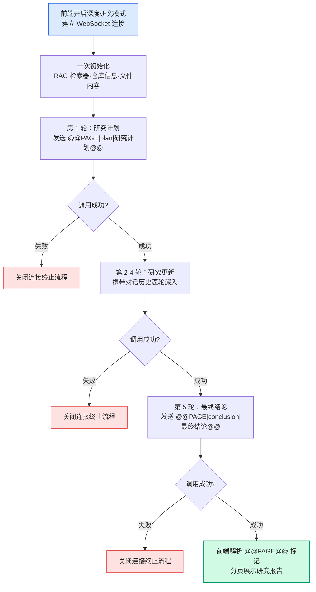

---

### 4.2.6 对话管理模块详细设计

对话管理模块负责用户与 AI 之间对话会话的全生命周期管理，包括对话和消息的增删改查以及反馈评价。后端路由实现在 [conversation_router.py](file:///d:/bishe/codewiki/api/conversation_router.py) 中，所有端点要求 Token 认证。

**（1）数据模型**

模块涉及三张核心表：`conversations`（对话历史表）通过 `user_id` 外键关联用户；`conversation_messages`（对话消息表）通过 `conversation_id` 外键关联对话，`role` 字段限制为 `user` 或 `assistant`，`message_type` 区分 `normal` 和 `deep_research`；`message_feedbacks`（消息反馈表）通过 `message_id` 外键关联消息。三表之间通过级联删除策略保证数据一致性。

**（2）核心端点**

模块共提供 7 个 RESTful 端点：`GET /api/conversations` 获取对话列表，支持按仓库过滤，按更新时间降序排列；`POST /api/conversations` 创建对话；`DELETE /api/conversations/{id}` 删除对话及其所有消息；`GET /api/conversations/{id}/messages` 获取消息列表，按创建时间正序排列；`POST /api/conversations/{id}/messages` 创建消息；`DELETE /api/conversations/{id}/messages/{mid}` 删除单条消息；`PATCH /api/conversations/{id}/messages/{mid}` 更新消息内容。所有端点均通过 `get_current_user` 验证对话所有权，防止越权访问。

**（3）消息反馈机制**

`POST /api/conversations/{cid}/messages/{mid}/feedback` 端点支持赞（liked）和踩（disliked）评价。反馈前校验类型合法性、对话所有权和消息存在性。已反馈的消息不可重复提交（返回 HTTP 409）。反馈采用双写策略：同时更新消息的 `feedback_status` 字段和创建 `message_feedbacks` 记录。点踩时可附带文字反馈说明问题。

**（4）前端交互**

对话管理前端集成在 Ask.tsx 组件中。左侧对话列表支持新建、选择和删除对话。对话标题自动取首条消息前 50 字符生成。消息采用乐观更新策略：用户消息立即渲染并异步保存，AI 回答在流式完成后保存。每条消息悬停显示删除按钮，消息反馈支持点赞和点踩（点踩弹出文字输入弹窗）。

对话管理模块的操作流程如图 4-9 所示。

> **图 4-9 对话管理模块活动图**

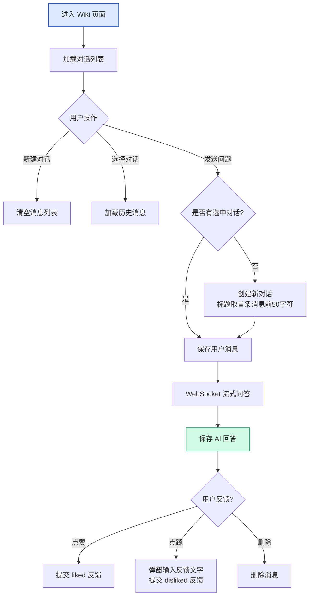

---

### 4.2.7 用户设置模块详细设计

用户设置模块允许用户个性化配置系统参数，后端路由实现在 [settings_router.py](file:///d:/bishe/codewiki/api/settings_router.py) 中。

**（1）配置数据模型**

用户配置以 JSON 格式存储在 `user_settings` 表的 `config` 字段中，与 `users` 表一对一关联。系统定义三个配置子模块：`embedding` 模块的 `dimension` 默认 1024，控制嵌入向量维度；`retrieval` 模块的 `top_k` 默认 20，控制 RAG 检索返回数量；`auto_refresh` 模块的 `enabled` 默认 `true`、`interval_minutes` 默认 60，控制增量索引自动刷新策略。

**（2）后端存储与更新**

后端提供 `GET /api/user/settings` 读取配置（无记录时返回默认值）和 `PUT /api/user/settings` 更新配置。更新采用增量合并策略：先深拷贝现有配置，再逐子模块用请求体中的字段更新对应项，仅修改传入的字段，保留未传入字段的现有值。该策略避免全量覆盖导致的并发编辑丢失问题。

**（3）配置生效链路**

用户配置的生效采用"后端统一查库"模式，避免前端冗余传递。Ask.tsx 发起问答时，`ChatCompletionRequest` 请求体不再携带 `top_k` 和 `dimension` 参数。后端 `_prepare_rag` 函数统一调用 `read_user_dimension_from_db()` 从 `user_settings` 表查询嵌入维度值，`read_user_top_k_from_db()` 查询检索 Top-K 值。若数据库中尚无用户配置记录，两个函数分别返回默认值（`dimension=1024`，`top_k=20`）；若已有配置则使用用户设定的值。该链路减少了前端对个人设置接口的依赖——即使从未访问过个人设置页面，后端也能通过默认值保证问答功能正常运行。自动刷新调度器在配置变更时通过先停止再启动的方式实现热更新。

用户设置模块的配置流程如图 4-10 所示。

> **图 4-10 用户设置模块活动图**

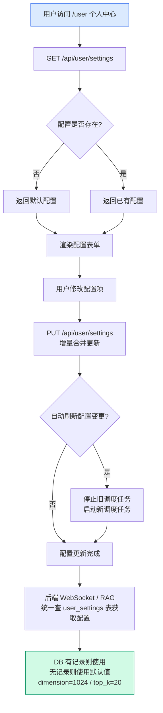

---

## 4.3 模块功能实现

下面部分介绍智能代码问答系统各个模块功能的实现，将通过文字描述介绍功能接口实现、类图介绍功能代码实现和展示实现界面截图相结合的方式来讲解每个模块包含功能的具体实现，从代码层到界面展示层全面展示每个功能的实现情况。

### 4.3.1 用户认证模块功能实现

用户认证模块的实现包括的接口有 `/auth/register`、`/auth/login`、`/auth/me`。

`/auth/register` 接口实现的是用户注册功能。`/auth/register` 接口对应的处理函数为 [auth_router.py](file:///d:/bishe/codewiki/api/auth_router.py) 中的 `register()` 函数，`register()` 函数接收前端传入的用户名、邮箱和密码，通过 SQLAlchemy ORM 的 `User` 模型类与数据库交互，首先在 `users` 表中查询用户名和邮箱是否已被占用，已占用则返回 HTTP 409 错误；未被占用则调用 `_pwd_context` 对象的 `hash()` 方法将密码通过 PBKDF2-SHA256 算法哈希处理后存入 `password_hash` 字段，提交数据库后调用 `_create_access_token()` 函数签发 JWT Token，返回 Token 和用户信息给前端。

`/auth/login` 接口实现的是用户登录功能。`/auth/login` 接口对应的处理函数为 [auth_router.py](file:///d:/bishe/codewiki/api/auth_router.py) 中的 `login()` 函数，`login()` 函数通过 `User` 模型类在 `users` 表中以用户名为条件查询用户记录，查到后调用 `_pwd_context` 对象的 `verify()` 方法比对密码哈希值，同时检查 `is_active` 字段确认账户是否启用，验证通过后调用 `_create_access_token()` 函数签发 JWT Token 返回给前端。

`/auth/me` 接口实现的是获取当前登录用户信息功能。`/auth/me` 接口对应的处理函数为 [auth_router.py](file:///d:/bishe/codewiki/api/auth_router.py) 中的 `me()` 函数，该函数通过 FastAPI 的依赖注入机制先调用 `get_current_user()` 函数进行 Token 校验——`get_current_user()` 函数从请求头提取 Bearer Token，调用 `_decode_token()` 函数使用 HS256 算法验签并提取用户 ID，再通过 `User` 模型类查询数据库确认用户存在且启用，最终将用户信息转换为 `UserOut` 模型返回。

用户认证模块功能实现对应的类图如图 4-11 所示。

> **图 4-11 用户认证模块类图**

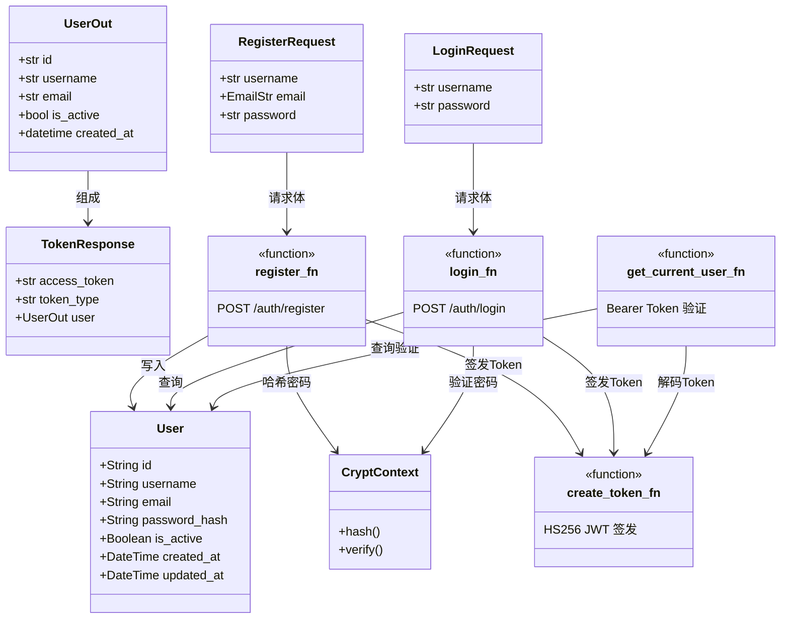

注册界面、登录界面实现如图 4-12、图 4-13 所示。

> **图 4-12 注册界面实现**
> **[截图待补充]**

> **图 4-13 登录界面实现**
> **[截图待补充]**

---

### 4.3.2 仓库管理模块功能实现

仓库管理模块的实现集中在前端 Dashboard 页面组件中，包括仓库地址解析、配置弹窗管理和历史项目列表三个子功能。

仓库地址解析功能通过 Dashboard 页面组件中的 `parseRepositoryInput()` 函数实现，该函数使用三个正则表达式按顺序匹配输入内容：Windows 路径正则匹配本地绝对路径，Unix 绝对路径前缀 `/` 匹配本地路径，Git URL 正则匹配远程仓库地址。解析成功后提取 `owner`、`repo`、`type` 等字段构造仓库信息对象，同时调用 `extractUrlDomain()` 和 `extractUrlPath()` 两个工具函数提取域名和路径信息用于类型判断。

配置弹窗管理功能通过 [ConfigurationModal.tsx](file:///d:/bishe/codewiki/src/components/ConfigurationModal.tsx) 组件实现。该组件聚合了语言选择、AI 模型选择、Wiki 类型设置、文件过滤器配置和访问令牌输入五个子配置项，用户调整完各项参数后点击提交，组件将配置序列化后通过 `localStorage.setItem()` 以仓库 URL 为键存入浏览器的 `deepwikiRepoConfigCache` 键中实现配置缓存，随后调用 `router.push()` 跳转至 `/[owner]/[repo]` 页面进入 Wiki 生成流程。

历史项目列表功能通过 [ProcessedProjects.tsx](file:///d:/bishe/codewiki/src/components/ProcessedProjects.tsx) 组件实现。该组件在挂载时调用 `/api/wiki/projects` 接口获取用户已处理的项目列表数据，每个项目展示仓库名称、所有者和处理时间等信息，支持按项目名称、仓库名等关键词搜索过滤，用户点击项目即可快速进入对应 Wiki 页面。删除功能通过向 `/api/wiki/projects` 发送 DELETE 请求清除服务端缓存。

仓库管理模块功能实现对应的类图如图 4-14 所示。

> **图 4-14 仓库管理模块类图**

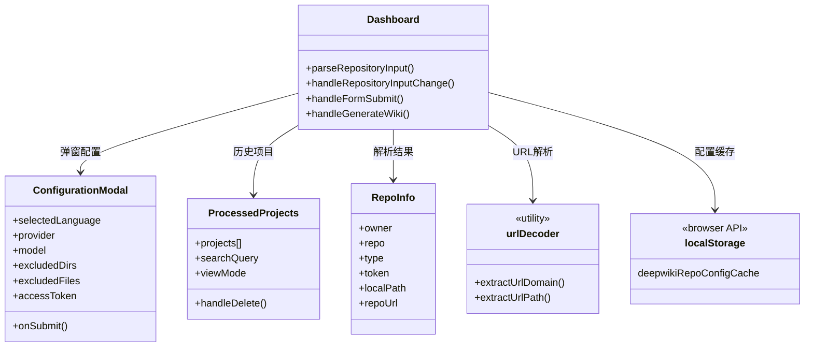

仓库输入与配置弹窗界面、历史项目列表界面实现如图 4-15、图 4-16 所示。

> **图 4-15 仓库输入与配置弹窗界面实现**
> **[截图待补充]**

> **图 4-16 历史项目列表界面实现**
> **[截图待补充]**

---

### 4.3.3 Wiki 生成模块功能实现

Wiki 生成模块的实现包括的接口有 `/local_repo/structure`、`POST /export/wiki` 以及内部处理管道 `DatabaseManager.prepare_database()`。

`/local_repo/structure` 接口实现的是获取本地仓库文件树和 README 内容的功能。前端 Wiki 页面加载时调用此接口，传入本地路径参数，后端读取文件系统返回文件树结构和 README 文件内容，前端基于这些数据通过大语言模型确定 Wiki 结构。

仓库下载功能通过 [data_pipeline.py](file:///d:/bishe/codewiki/api/data_pipeline.py) 中的 `download_repo()` 函数实现，该函数通过 Python 的 `subprocess` 模块执行 `git clone --depth=1 --single-branch` 命令进行浅克隆，若提供访问令牌则将 Token 编码后嵌入 Git URL 以访问私有仓库。文件读取通过 `read_all_documents()` 函数实现，该函数遍历仓库目录，应用排除/包含过滤器筛选文件，返回文档列表供后续拆分处理。

代码拆分功能通过 [code_splitter.py](file:///d:/bishe/codewiki/api/code_splitter.py) 中的 `TreeSitterCodeSplitter` 类实现。`TreeSitterCodeSplitter` 类内部维护 `EXTENSION_TO_LANGUAGE` 字典将文件扩展名映射到 Tree-sitter 语言标识，`CHUNK_NODE_TYPES` 字典定义各语言的 AST 节点类型（如 Python 的 `function_definition`、`class_definition`），调用 Tree-sitter 解析器生成 AST 后遍历语法树并按语义单元切分代码，每个切分块附带文件路径、函数名、类名、起止行号等元数据。

向量嵌入与索引构建功能通过 `DatabaseManager` 类的 `prepare_db_index()` 方法实现。该方法首先检查 Qdrant 中是否已存在该仓库的集合，若存在则直接复用；若不存在，则通过一次样本嵌入探测确定向量维度，创建 Qdrant 集合后调用 `read_all_documents()` 获取文档列表，依次经过 Tree-sitter 拆分、DashScope Embedding 向量化和 `QdrantManager.upsert_chunks()` 批量写入三步完成索引构建。

增量索引刷新功能通过 [incremental_index.py](file:///d:/bishe/codewiki/api/incremental_index.py) 模块实现。`incremental_update_for_repo()` 函数首先调用 `git_pull()` 函数执行 `git pull --ff-only` 获取远程更新，然后调用 `get_changed_files()` 函数通过 `git diff --name-status` 获取变更文件列表并封装为 `RepoDiff` 对象，对于 `RepoDiff` 中的新增和修改文件重新执行拆分和嵌入流程，对于删除文件从 Qdrant 中移除对应向量点。文件按批次处理每批最多 120 个文件。定时调度通过 `_auto_refresh_loop()` 异步循环实现，按用户配置的间隔时间定期执行。

Wiki 生成模块功能实现对应的类图如图 4-17 所示。

> **图 4-17 Wiki 生成模块类图**

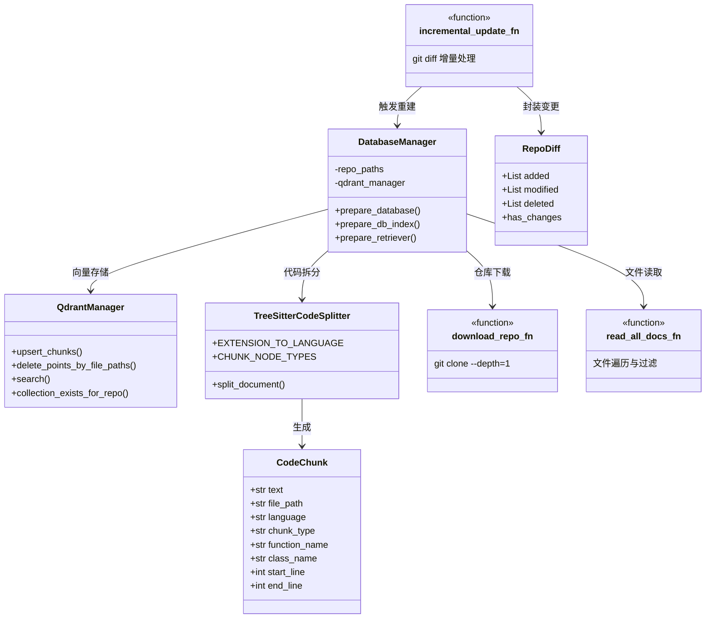

Wiki 树形结构展示界面、全面 Wiki 视图界面实现如图 4-18、图 4-19 所示。

> **图 4-18 Wiki 树形结构展示界面实现**
> **[截图待补充]**

> **图 4-19 全面 Wiki 视图界面实现**
> **[截图待补充]**

---

### 4.3.4 智能问答模块功能实现

智能问答模块的实现包括的 WebSocket 端点为 `/ws/chat`，降级兜底 HTTP 端点为 `/chat/completions/stream`，前端核心组件为 `Ask.tsx`。

`/ws/chat` 端点实现的是通过 WebSocket 协议的实时流式问答功能。`/ws/chat` 端点对应的处理函数为 [websocket_wiki.py](file:///d:/bishe/codewiki/api/websocket_wiki.py) 中的 `handle_websocket_chat()` 函数。WebSocket 连接建立后，前端 `Ask.tsx` 组件发送 `ChatCompletionRequest` 请求体（包含仓库 URL、对话消息列表、AI 模型配置、语言参数和文件过滤信息），`handle_websocket_chat()` 函数接收请求后首先调用 `_prepare_rag()` 函数初始化 RAG 检索器——该函数通过 `RAG` 类的 `prepare_retriever()` 方法连接 Qdrant 向量数据库并从 `user_settings` 表查询用户配置的维度和 Top-K 参数；接着调用 `Memory` 类的 `add_dialog_turn()` 方法加载历史对话，调用 `_retrieve_context()` 函数执行语义检索获取相关代码上下文，调用 `_build_prompt()` 函数组装包含系统提示词、对话历史、文件内容和检索上下文的完整 Prompt；最后通过 `DashscopeClient` 类的 `acall()` 方法向 DashScope 平台发送异步请求进行流式生成，生成的每个文本片段通过 WebSocket 实时推送到前端，前端 `Markdown` 组件逐 Token 渲染展示。

容错降级方面，当 LLM 返回 Token 超限错误时，`_stream_llm_response()` 函数自动调用 `_strip_context_from_prompt()` 函数将 Prompt 中的检索上下文区块移除后重新发起请求；当 WebSocket 连接失败时，前端自动降级至 `POST /chat/completions/stream` HTTP 端点，该端点对应的处理函数为 [simple_chat.py](file:///d:/bishe/codewiki/api/simple_chat.py) 中的 `chat_completions_stream()` 函数，通过 HTTP 流式响应维持问答功能可用。

智能问答模块功能实现对应的类图如图 4-20 所示。

> **图 4-20 智能问答模块类图**

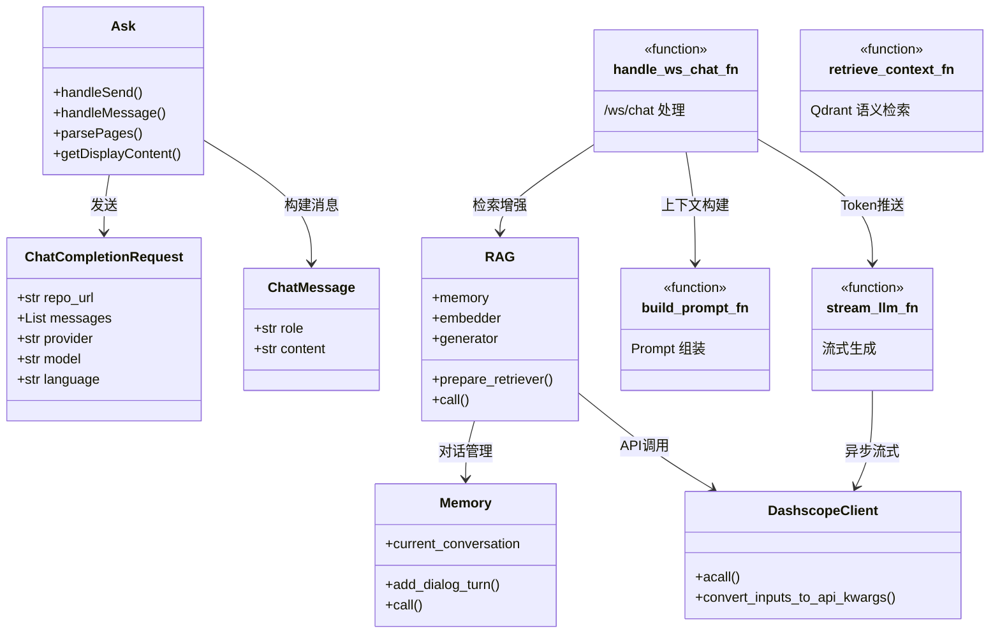

智能问答界面、问答结果展示界面实现如图 4-21、图 4-22 所示。

> **图 4-21 智能问答界面实现**
> **[截图待补充]**

> **图 4-22 问答结果展示界面实现**
> **[截图待补充]**

---

### 4.3.5 深度研究模块功能实现

深度研究模块的实现包括的 WebSocket 端点为 `/ws/chat/deep-research`，与普通问答共享前端 `Ask.tsx` 组件，通过深度研究开关区分模式。

`/ws/chat/deep-research` 端点实现的是多轮迭代式的深度代码分析功能。`/ws/chat/deep-research` 端点对应的处理函数为 [websocket_wiki.py](file:///d:/bishe/codewiki/api/websocket_wiki.py) 中的 `handle_websocket_chat_deep_research()` 函数。WebSocket 连接建立后，该函数接收前端提交的一个用户问题，首先一次性完成 RAG 检索器初始化、仓库信息提取和代码上下文检索（后续 5 轮迭代共享此检索结果以避免重复开销），然后进入最大 5 轮的服务端迭代循环。

第 1 轮迭代使用 `_DEEP_RESEARCH_PLAN_PROMPT` 提示词模板，要求模型制定研究计划、识别关键方面并提供初步发现。第 2 至 4 轮迭代使用 `_DEEP_RESEARCH_UPDATE_PROMPT` 提示词模板，每次迭代将之前所有轮次的问答内容累积为对话历史传给模型，要求模型在前序研究基础上识别空白点并针对性地深入分析，不重复已有内容。第 5 轮迭代使用 `_DEEP_RESEARCH_CONCLUSION_PROMPT` 提示词模板，要求模型综合前四轮的所有发现，提供包含具体代码引用和实现细节的完整结论。每轮迭代开头通过 `@@PAGE|type|title@@` 标记符分隔不同阶段的研究成果，前端 `Ask.tsx` 组件的 `parsePages()` 函数实时解析这些标记符将流式响应切分为多个 `ChatPage` 对象（类型包括 plan、update、conclusion），用户通过页面顶部的导航条在各研究阶段之间自由切换浏览。

若任一迭代轮次的 LLM 调用失败（如 Token 超限），`_stream_llm_response()` 函数自动执行检索上下文降级重试；若降级仍然失败，则终止整体研究流程并关闭 WebSocket 连接。

深度研究模块功能实现对应的类图如图 4-23 所示。

> **图 4-23 深度研究模块类图**

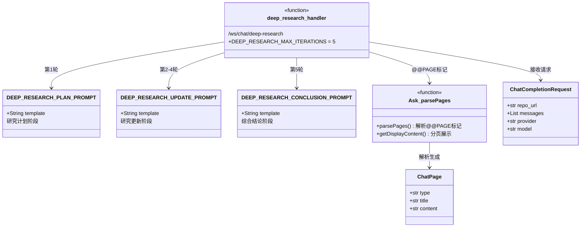

深度研究界面、深度研究分页展示界面实现如图 4-24、图 4-25 所示。

> **图 4-24 深度研究界面实现**
> **[截图待补充]**

> **图 4-25 深度研究分页展示界面实现**
> **[截图待补充]**

---

### 4.3.6 对话管理模块功能实现

对话管理模块的实现包括的接口有 `/api/conversations`（GET/POST）、`/api/conversations/{id}`（DELETE）、`/api/conversations/{id}/messages`（GET/POST）、`/api/conversations/{cid}/messages/{mid}`（PATCH/DELETE）、`/api/conversations/{cid}/messages/{mid}/feedback`（POST），共计 8 个结束点，全部要求 Bearer Token 认证。

`GET /api/conversations` 接口实现的是获取指定仓库下对话列表的功能。`GET /api/conversations` 接口对应的处理函数为 [conversation_router.py](file:///d:/bishe/codewiki/api/conversation_router.py) 中的 `list_conversations()` 函数，该函数接收仓库所有者和仓库名称两个查询参数，通过 `Conversation` 模型类在 `conversations` 表中查询当前用户在指定仓库下的所有对话记录，按更新时间倒序排列，通过 `_conversation_to_out()` 函数将 ORM 对象转换为 `ConversationOut` 响应模型返回。

`POST /api/conversations` 接口实现的是创建新对话的功能。`POST /api/conversations` 接口对应的处理函数为 [conversation_router.py](file:///d:/bishe/codewiki/api/conversation_router.py) 中的 `create_conversation()` 函数，该函数接收仓库所有者、仓库名称和对话标题，通过 UUID 生成唯一对话 ID，创建 `Conversation` 模型实例并写入数据库，返回新创建的对话信息。

`DELETE /api/conversations/{id}` 接口实现的是删除对话及其关联消息的功能。该接口对应的处理函数为 [conversation_router.py](file:///d:/bishe/codewiki/api/conversation_router.py) 中的 `delete_conversation()` 函数，首先验证对话属于当前用户（防止越权访问），验证通过后执行删除操作——由于 `Conversation` 模型与 `ConversationMessage` 模型配置了 `cascade="all, delete-orphan"` 级联删除策略，删除对话时数据库自动清理其下所有消息记录。

`GET /api/conversations/{id}/messages` 和 `POST /api/conversations/{id}/messages` 接口分别实现获取消息列表和创建消息的功能，对应的处理函数为 `get_conversation_messages()` 和 `create_conversation_message()` 函数。获取消息时按创建时间正序排列并转换为 `MessageOut` 响应模型；创建消息时验证消息角色（`user` 或 `assistant`）和对话归属，写入数据库后同步更新对话的 `updated_at` 时间戳。

`POST /api/conversations/{cid}/messages/{mid}/feedback` 接口实现的是消息反馈提交功能。该接口对应的处理函数为 [conversation_router.py](file:///d:/bishe/codewiki/api/conversation_router.py) 中的 `submit_message_feedback()` 函数，接收反馈类型（`liked` 或 `disliked`）和可选的文字反馈内容。该函数首先检查消息是否已被反馈过——若 `feedback_status` 字段已有值则返回 HTTP 409 错误禁止重复提交；若未反馈则创建新的 `MessageFeedback` 记录，同时同步更新 `ConversationMessage` 表的 `feedback_status` 字段以快速展示反馈状态。

`PATCH /api/conversations/{cid}/messages/{mid}` 接口实现的是更新消息内容的功能，允许修改消息正文、Token 数量和消息类型字段，采用增量更新策略仅更新传入的非空字段。

对话管理模块功能实现对应的类图如图 4-26 所示。

> **图 4-26 对话管理模块类图**

```mermaid
classDiagram
    class Conversation {
        +String id
        +String user_id
        +String repo_owner
        +String repo_name
        +String repo_type
        +String title
        +DateTime created_at
        +DateTime updated_at
    }
    class ConversationMessage {
        +String id
        +String conversation_id
        +String role
        +Text content
        +Int token_count
        +String feedback_status
        +String message_type
        +DateTime created_at
    }
    class MessageFeedback {
        +String id
        +String message_id
        +String feedback_type
        +Text comment
        +DateTime created_at
    }
    class ConversationOut {
        +str id
        +str userId
        +str repoOwner
        +str repoName
        +str title
    }
    class CreateConversationRequest {
        +str repoOwner
        +str repoName
        +str title
    }
    class CreateMessageRequest {
        +str role
        +str content
        +str messageType
    }
    class CreateFeedbackRequest {
        +str feedbackType
        +str comment
    }
    class list_conversations_fn {
        <<function>>
        GET /api/conversations
    }
    class create_conversation_fn {
        <<function>>
        POST /api/conversations
    }
    class delete_conversation_fn {
        <<function>>
        DELETE /api/conversations/:id
    }
    class feedback_fn {
        <<function>>
        POST feedback
    }

    Conversation --> ConversationMessage : 1:N 级联删除
    ConversationMessage --> MessageFeedback : 1:1 反馈
    CreateConversationRequest --> Conversation : 创建
    CreateMessageRequest --> ConversationMessage : 创建
    CreateFeedbackRequest --> MessageFeedback : 创建
    list_conversations_fn --> Conversation : 查询
    create_conversation_fn --> Conversation : 写入
    delete_conversation_fn --> Conversation : 删除
    feedback_fn --> MessageFeedback : 写入
    feedback_fn --> ConversationMessage : 同步状态
```

对话列表与新建对话界面、对话消息与反馈界面实现如图 4-27、图 4-28 所示。

> **图 4-27 对话列表与新建对话界面实现**
> **[截图待补充]**

> **图 4-28 对话消息与反馈界面实现**
> **[截图待补充]**

---

### 4.3.7 用户设置模块功能实现

用户设置模块的实现包括的接口有 `/api/user/settings`（GET/PUT）。

`GET /api/user/settings` 接口实现的是读取当前用户个性化配置的功能。`GET /api/user/settings` 接口对应的处理函数为 [settings_router.py](file:///d:/bishe/codewiki/api/settings_router.py) 中的 `get_user_settings()` 函数，该函数通过 `get_current_user` 依赖注入获取当前登录用户，通过 `UserSettings` 模型类在 `user_settings` 表中查询该用户的配置记录。若记录不存在则返回 `_DEFAULT_CONFIG` 常量定义的默认配置（嵌入维度 1024、Top-K 为 20、自动刷新启用且间隔 60 分钟）；若记录存在则通过 `_row_config()` 函数提取三个子模块的配置数据返回。

`PUT /api/user/settings` 接口实现的是更新用户个性化配置的功能。`PUT /api/user/settings` 接口对应的处理函数为 [settings_router.py](file:///d:/bishe/codewiki/api/settings_router.py) 中的 `update_user_settings()` 函数，该函数首先查询用户配置记录是否存在——不存在则创建一条新记录，存在则运用增量合并策略更新：通过 `_ensure_dict()` 函数深拷贝现有配置字典，然后遍历三个子模块键名（`embedding`、`retrieval`、`auto_refresh`），仅将请求体中传入的子模块字段合并到现有配置中，保留未传入字段的原有值。增量合并策略避免了全量替换导致的并发编辑丢失问题，最后提交数据库变更并返回更新后的完整配置。

此外，为了实现后端统一查库获取配置的需求，[settings_router.py](file:///d:/bishe/codewiki/api/settings_router.py) 中还提供了两个独立于 FastAPI 依赖注入的共享辅助函数：`read_user_dimension_from_db()` 函数自主打开数据库会话查询 `user_settings` 表中第一条记录的嵌入维度值，无记录返回 `None`；`read_user_top_k_from_db()` 函数同理查询 Top-K 值，无记录返回默认值 20。这两个函数供 WebSocket 处理器等非 FastAPI 上下文场景调用，使后端问答流程无需依赖前端传递参数即可获取用户配置。

用户设置模块功能实现对应的类图如图 4-29 所示。

> **图 4-29 用户设置模块类图**

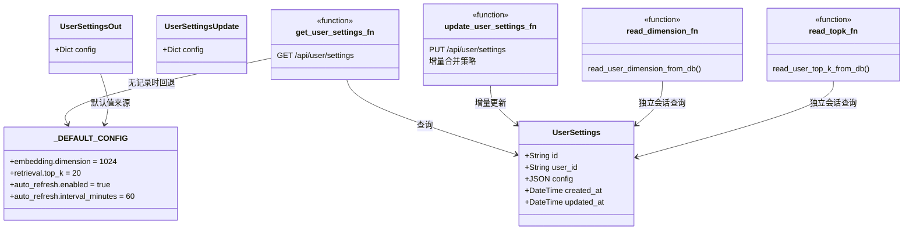

用户设置界面实现如图 4-30 所示。

> **图 4-30 用户设置界面实现**
> **[截图待补充]**